# Praktikum Modul 1 Jarkom

|No|Nama anggota|NRP|
|---|---|---|
|1. | Tasya Aulia Darmawan | 5027241009|
|2. | Ahmad Rafi Rafi F D | 5027241068|

## Soal 1
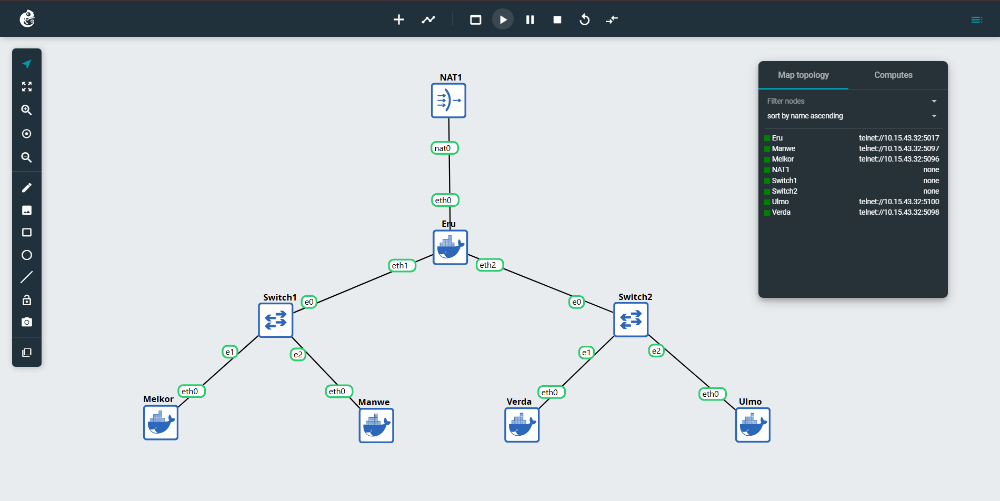
```
**ERU**
auto eth0
iface eth0 inet dhcp

auto eth1
iface eth1 inet static
    address 192.227.1.1     <--- My Group prefix ip || with connection to the switch 1
    netmask 255.255.255.0

auto eth2
iface eth2 inet static
    address 192.227.2.1     <--- connected to the switch 2
    netmask 255.255.255.0

up iptables -t nat -A POSTROUTING -o eth0 -j MASQUERADE -s 192.227.0.0/16

**Melkor**
auto eth0
iface eth0 inet static
    address 192.227.1.2     <--- connected to the switch 1 || using 1.2
    netmask 255.255.255.0
    gateway 192.227.1.1

Menwa
auto eth0
iface eth0 inet static
 	address 192.227.1.3     <--- using 1.3
 	netmask 255.255.255.0
 	gateway 192.227.1.1


Verda
auto eth0
iface eth0 inet static
 	address 192.227.2.2     <--- connected to the switch 2 || using 2.2
 	netmask 255.255.255.0
 	gateway 192.227.1.1


Ulmo
auto eth0
iface eth0 inet static
 	address 192.227.2.3     <--- using 2.3
 	netmask 255.255.255.0
 	gateway 192.227.1.1

```
On question 1, we've been given a task to a simple network topology with `Eru` as the **router** with 2 **Switch/Gateway**. Followed with 4 **Clients** that's `Melkor` and `Manwe` connected to the 1st switch, and `Verda` and `Ulmo` that connected to the 2nd switch. Above, is the image which portrayed as the topology in the context, and its **network configs** in GNS3 client to connect every single node to the router and connected to the NAT/Internet through the switches and customized with our group prefix IP's. This eventually also answers question number 3.

Below, is the configs in the `CLI` to connect every single nodes (clients) **really** connected to the Internet/NAT.

```
> **CLI CONFIGS**
nano /root/.bashrc    <--- TO SAVED EVERY SINGLE CONFIGS AND TOOLS THAT NEEDED

> eru
apt update
apt install -y iptables
apt install -y wget
apt install -y unzip
apt install -y vsftpd
apt install -y netcat-traditional
apt install -y ftp
apt install -y telnet
apt install -y openssh-server	
iptables -t nat -A POSTROUTING -o eth0 -j MASQUERADE -s 192.227.0.0/16     <--- This is a must to connect every single nodes/clients to the Internet/ do the mesquerading to the public IP and postrouting which enable NAT from the switches/gateaways
echo nameserver 192.168.122.1 > /etc/resolv.conf    <--- Setting DNS resolver in router

> clients (Melkor/Menwa/Verda/Ulmo)
apt update
apt-get install -y wget
apt-get install -y unzip
apt-get install -y vsftpd
apt-get install -y netcat-traditional
apt-get install -y ftp
apt-get install -y openbsd-inetd telnetd
apt-get install -y telnet
apt-get install -y apache2
apt-get install -y openssh-server
echo nameserver 192.168.122.1 > /etc/resolv.conf    <--- Setting DNS resolver in the clients

> MUST [source /root/.bashrc] after login, idk it's installed but not unpacked.
> The installed things will be used in the following question, this is the ESSENTIAL tools to make things easier later.
```
## Soal 2
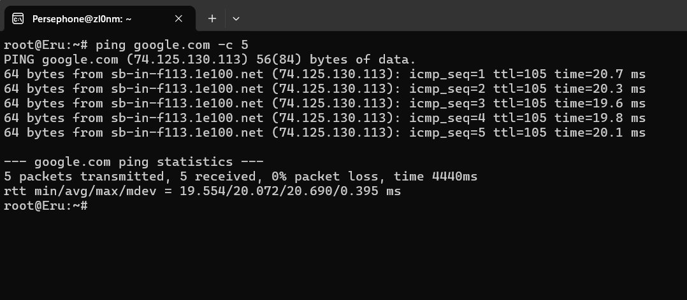
```
> In Eru
nano /root/.bashrc

iptables -t nat -A POSTROUTING -o eth0 -j MASQUERADE -s 192.227.0.0/16     <--- This is a must to connect every single nodes/clients to the Internet / do the mesquerading to the public IP and postrouting which enable NAT from the switches/gateaways
echo nameserver 192.168.122.1 > /etc/resolv.conf    <--- Setting DNS resolver in router
```
The things above is what we need to connect `Eru` to the Internet/NAT. By setting the iptables, which also will do **POSTROUTING** and **MASQUERADE** their source IP to the Public IP `{eth0}` and when the it sends back it will return to their own internal IPs. Which is, is the mechanism of NAT.

The first command enables Network Address Translation (NAT) on the router. This rule applies **POSTROUTING** and **MASQUERADE** to packets leaving through the `eth0`. Which is, all packets originating from the internal network `(192.227.0.0/16)` will have their source IP addresses replaced with the router’s public IP (from eth0). When the responses return, the router translates them back to the respective internal IPs. This is the fundamental mechanism of **NAT**, which allows all internal nodes/clients to access the Internet through a single public IP.

The second command will sets the DNS resolver of the router by writing 192.168.122.1 into /etc/resolv.conf, enabling proper domain name resolution connected. Without this, even commands like `ping google.com` would fail, even if **NAT** is configured.

## Soal 3 dan 4
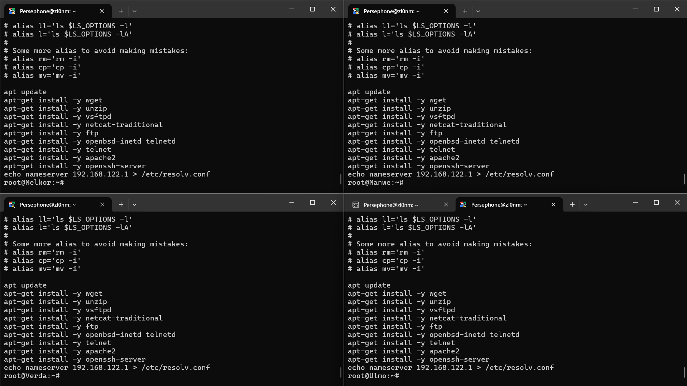
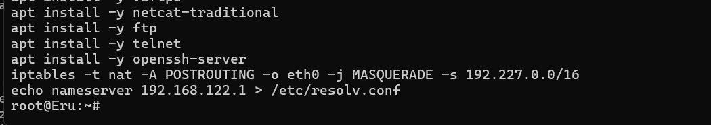
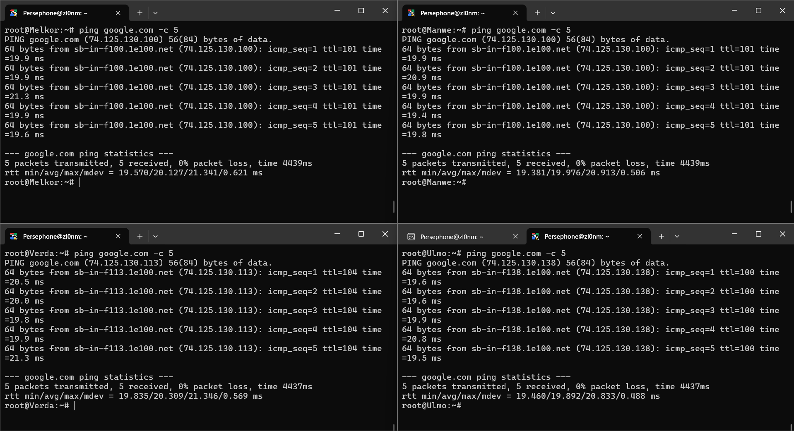
```
> clients (Melkor/Menwa/Verda/Ulmo)
nano /root/.bashrc

apt update
apt-get install -y wget
apt-get install -y unzip
apt-get install -y vsftpd
apt-get install -y netcat-traditional
apt-get install -y ftp
apt-get install -y openbsd-inetd telnetd
apt-get install -y telnet
apt-get install -y apache2
apt-get install -y openssh-server
echo nameserver 192.168.122.1 > /etc/resolv.conf    <--- Setting DNS resolver in the clients (THE IMPORTANT ONE)

> MUST [source /root/.bashrc] after login, idk it's installed but not unpacked.
> The installed things will be used in the following question, this is the ESSENTIAL tools to make things easier later.
```
By setting the DNS resolver (/etc/resolv.conf) `(echo nameserver 192.168.122.1 > /etc/resolv.conf)`, this ensures that all clients can resolve domain names correctly similar to the router. AND, now all clients should able to **connected** and **communicate** with each other by themselves over the internal network.

## Soal 5
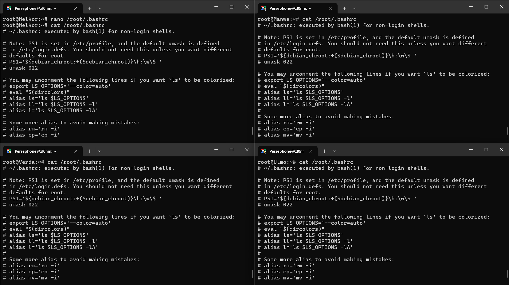
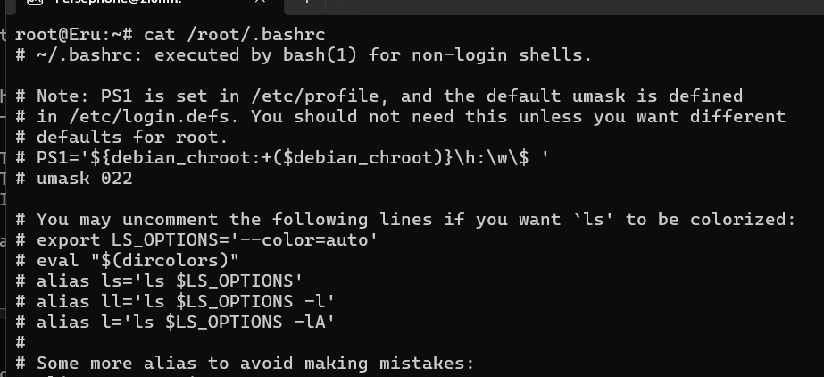
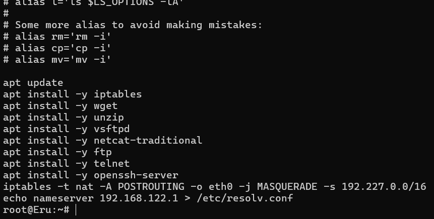
```
nano /root/.bashrc    <--- TO SAVED EVERY SINGLE CONFIGS AND TOOLS THAT NEEDED

> eru
apt update
apt install -y iptables
apt install -y wget
apt install -y unzip
apt install -y vsftpd
apt install -y netcat-traditional
apt install -y ftp
apt install -y telnet
apt install -y openssh-server	
iptables -t nat -A POSTROUTING -o eth0 -j MASQUERADE -s 192.227.0.0/16     <--- This is a must to connect every single nodes/clients to the Internet/ do the mesquerading to the public IP and postrouting which enable NAT from the switches/gateaways
echo nameserver 192.168.122.1 > /etc/resolv.conf    <--- Setting DNS resolver in router

> clients (Melkor/Menwa/Verda/Ulmo)
apt update
apt-get install -y wget
apt-get install -y unzip
apt-get install -y vsftpd
apt-get install -y netcat-traditional
apt-get install -y ftp
apt-get install -y openbsd-inetd telnetd
apt-get install -y telnet
apt-get install -y apache2
apt-get install -y openssh-server
echo nameserver 192.168.122.1 > /etc/resolv.conf    <--- Setting DNS resolver in the clients

> MUST [source /root/.bashrc] after login, idk it's installed but not unpacked.
> The installed things will be used in the following question, this is the ESSENTIAL tools to make things easier later.
```
Above, is the scripts that will be used in this question.
To prevent the configuration and installed tools from being lost after a node restart/reload, all essential commands are saved into the `/root/.bashrc` file.
When a Linux machine starts up and a root user logs in, the `.bashrc` file is automatically executed. By placing the installation and configuration commands here, the environment with its essential tools (which will be used in the following questions) is restored automatically after each restart.

## Soal 6
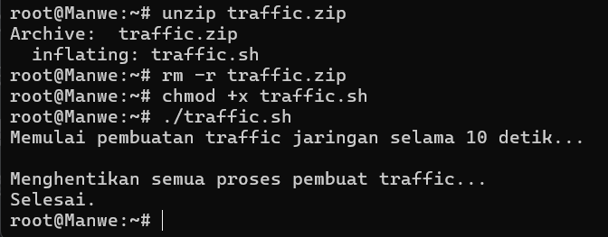
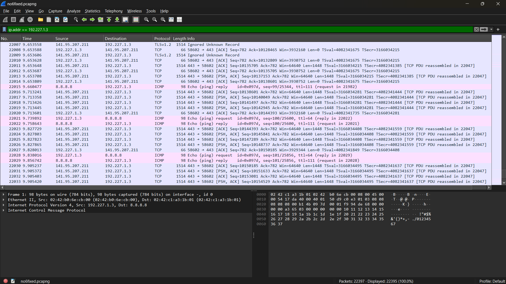
```
> in manwe
wget --no-check-certificate "https://drive.google.com/uc?export=download&id=1bE3kF1Nclw0VyKq4bL2VtOOt53IC7lG5" -O traffic.zip

unzip traffic.zip

chmod +x traffic.sh

>> go to wireshark
start capture > manwe -> eru 

./traffic.sh
```
> **STEP BY STEP WALKTROUGH**

**1. Download the Traffic File on Manwe**

On the Manwe node, we first download the traffic simulation file:

```
wget --no-check-certificate "https://drive.google.com/uc?export=download&id=1bE3kF1Nclw0VyKq4bL2VtOOt53IC7lG5" -O traffic.zip
unzip traffic.zip
chmod +x traffic.sh
```

This script is designed to generate various network traffic between Manwe and Eru, simulating normal and potentially suspicious communication.

**2. Start Wireshark Capture**

Before running the script, we open Wireshark on the Manwe–Eru and start capturing packets and record all the traffic generated by the script.

**3. Run the Traffic Simulation**

Back on Manwe, execute:

`./traffic.sh`

This will start sending various types of packets to Eru — which is some `PING` req/sends traffic. Wireshark records these packets in real time.

**4. Apply Display Filter in Wireshark**

Once the capture is complete, we stop Wireshark and apply a display filter to isolate traffic to and from Manwe’s IP (which is 192.227.1.3) address.

`ip.addr == 192.227.1.3`


This filter shows only the packets either originating from or destined to Manwe, allowing us to focus specifically on the communication between Manwe and Eru.

## Soal 7
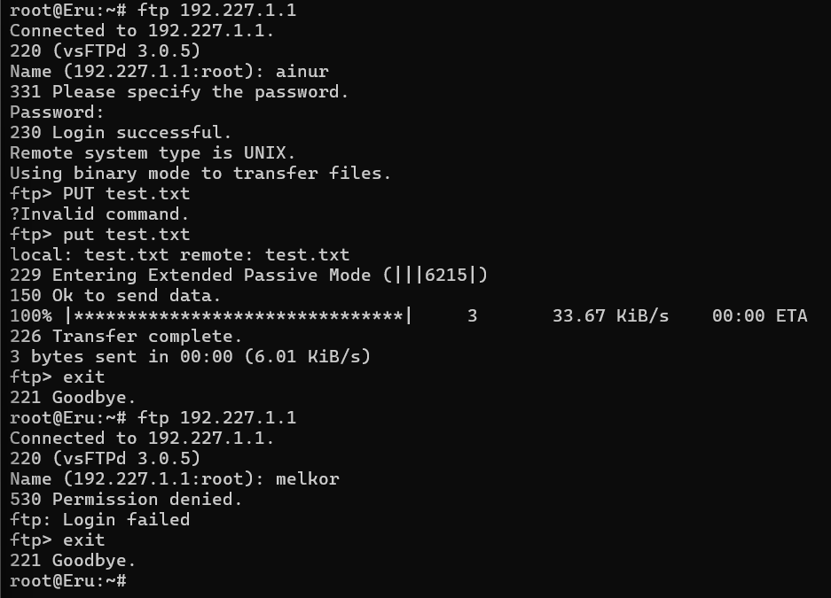
```
> in eru
apt update && apt-get install vsftpd -y && apt install ftp -y (if its not installed yet)

mkdir -p /srv/ftp/shared

adduser ainur
adduser melkor
usermod -d /srv/ftp/shared ainur
usermod -d /srv/ftp/shared melkor
chown ainur:ainur /srv/ftp/shared
chmod 755 /srv/ftp/shared

> config the vsftpd
nano /etc/vsftpd.conf

listen=YES
listen_ipv6=NO
anonymous_enable=NO
local_enable=YES
write_enable=YES
chroot_local_user=YES
allow_writeable_chroot=YES
userlist_enable=YES
userlist_file=/etc/vsftpd.user_list
userlist_deny=YES

> add melkor to userlist
echo "melkor" > /etc/vsftpd.user_list

/usr/sbin/vsftpd /etc/vsftpd.conf & (to run)
netstat -tulnp | grep :21 (check if running)
pkill vsftpd (kill run)

> in eru (still)
echo "hi" > test.txt

ftp 192.227.1.1
login > ainur -> has to be logged in (can GET PUT ls)
PUT test.txt (to test)

login > melkor -> CANT logged in
```

> **INITIAL SCENARIO**

To improve network security, Eru decides to set up an FTP server on its node. Two users are created:

`ainur` → granted read & write access to the shared FTP directory.
`melkor` → denied access to the shared FTP directory.

The goal is to configure the FTP server using **vsftpd**, set up user permissions, and verify the configuration through login tests.

---

> **Step-by-Step Walkthrough**

**1. Install FTP Server and Client (IF HAVEN'T)**

On Eru, install the FTP server (vsftpd) and FTP client:

`apt update && apt-get install vsftpd -y && apt install ftp -y`

**2. Create Shared Directory and Users**

Set up the shared directory and two users (ainur and melkor):

```
mkdir -p /srv/ftp/shared

adduser ainur
adduser melkor

usermod -d /srv/ftp/shared ainur
usermod -d /srv/ftp/shared melkor

chown ainur:ainur /srv/ftp/shared
chmod 755 /srv/ftp/shared
```

`ainur` is assigned the shared directory as the home directory and given ownership.

melkor is also pointed to the shared directory but will be explicitly denied access later via configuration.

**3. Configure vsftpd**

Edit `/etc/vsftpd.conf`:

`nano /etc/vsftpd.conf`

Ensure the following configuration:
```
listen=YES
listen_ipv6=NO
anonymous_enable=NO
local_enable=YES
write_enable=YES
chroot_local_user=YES
allow_writeable_chroot=YES
userlist_enable=YES
userlist_file=/etc/vsftpd.user_list
userlist_deny=YES
```

Explanation:

- `local_enable=YES` → allows local users to log in.
- `write_enable=YES` → enables file upload (write) operations.
- `chroot_local_user=YES` → locks users in their home directory (for security).
- `userlist_enable=YES` and `userlist_deny=YES` → users listed in `/etc/vsftpd.user_list` will not be allowed to log in.

**4. Restrict Melkor’s Access**

Add melkor to the denied user list:

`echo "melkor" > /etc/vsftpd.user_list`

This ensures that melkor will be rejected at login, even though the account exists.

**5. Start vsftpd Service**

Run the vsftpd server:

`/usr/sbin/vsftpd /etc/vsftpd.conf &`

Verify it’s listening on port 21:

`netstat -tulnp | grep :21`

If needed, we can kill and restart the service using: `pkill vsftpd`

**6. Create a Test File**

Create a simple file to test upload/download:

`echo "hi" > test.txt`

**7. Test FTP Login with Ainur**

Using FTP, log in as ainur:
```
ftp 192.227.1.1


Username: ainur

Password: (set earlier during user creation)
```

Once logged in, we should be able to:

- List files (ls)
- Download files (GET test.txt)
- Upload files (PUT test.txt)

This confirms that ainur has read and write access.

**8. Test FTP Login with Melkor**

Try logging in as melkor:
```
ftp 192.227.1.1


Username: melkor

Password: (set earlier during user creation)
```

The login should fail, since melkor is explicitly denied in `/etc/vsftpd.user_list`.

Which is confirms that access control in the shared folder is working as intended.

## Soal 8
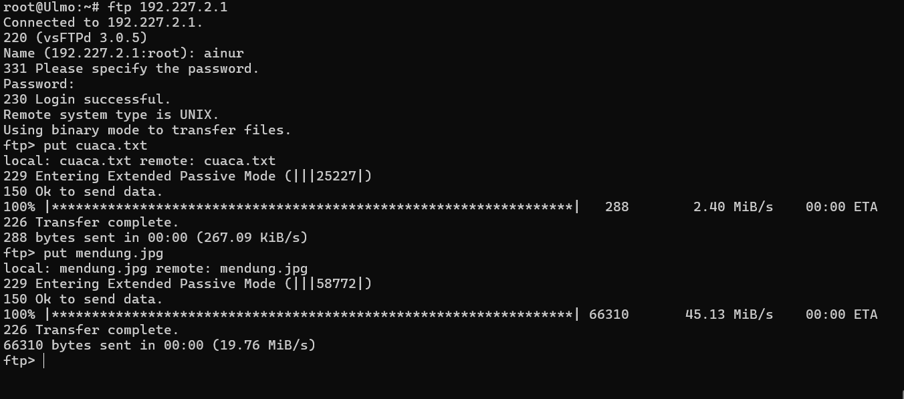
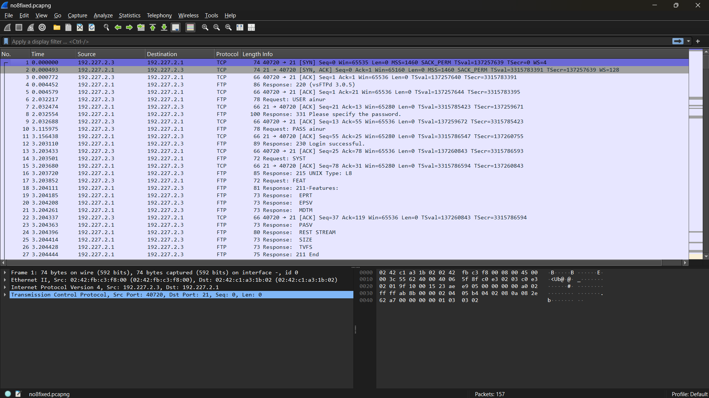
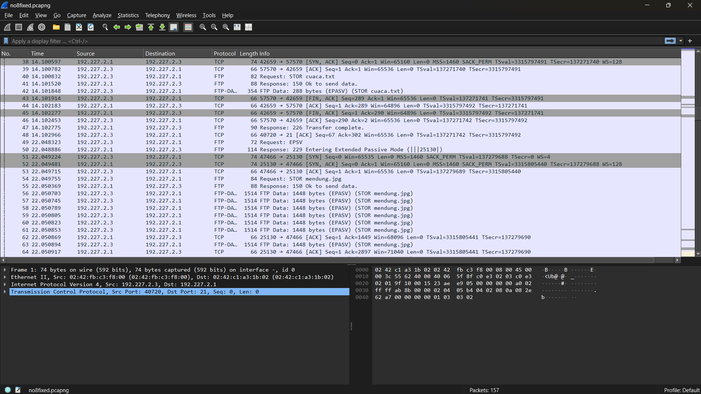
```
> in ulmo
login ftp > ftp 192.227.2.1
wget --no-check-certificate "https://drive.google.com/uc?export=download&id=11ra_yTV_adsPIXeIPMSt0vrxCBZu0r33" -O ramalan-cuaca.zip
unzip ramalan-cuaca.zip

> go to eru
service vsftpd start

>> on wireshark
start capture > Ulmo -> eru

> go back to ulmo
put <ramalan_cuaca files>
```

> **Step-by-Step Walkthrough**

**1. Download Weather Forecast File on Ulmo**

On Ulmo, download and extract the file:
```
wget --no-check-certificate "https://drive.google.com/uc?export=download&id=11ra_yTV_adsPIXeIPMSt0vrxCBZu0r33" -O ramalan-cuaca.zip
unzip ramalan-cuaca.zip
```

This produces a weather data file to be uploaded to Eru’s FTP server.

**2. Start FTP Server on Eru**

Make sure the FTP server is running: `service vsftpd start`

**3. Start Wireshark Capture**

Open Wireshark on the Eru–Ulmo interface and start capturing traffic.
This ensures that the entire FTP upload process is recorded.

**4. FTP Login from Ulmo to Eru**

On Ulmo, connect to the FTP server using ainur:
```
ftp 192.227.2.1


Username: ainur

Password: (set previously)
```
**5. Upload the File**

Within the FTP session, upload the extracted file to Eru: `put ramalan_cuaca.txt`

This triggers the FTP file upload process, which uses:

- Control channel (port 21) → for sending FTP commands.
- Data channel (random high port) → for transferring the actual file contents.

**6. Analyze FTP Commands in Wireshark**

After the upload completes, stop the Wireshark capture and apply the following display filter to focus on FTP control commands: `ftp`

With the following sequence of FTP commands during the upload process, we will see:

- `USER ainur` → Client provides username for authentication.
- `PASS ainur` → Client sends password.
- `STOR ramalan_cuaca.txt` and `STOR mendung.jpg`→ Command to upload the file to the server.

This command tells the server to store the incoming file with the specified name. The actual file data is sent over the data channel immediately after this command.
## Soal 9
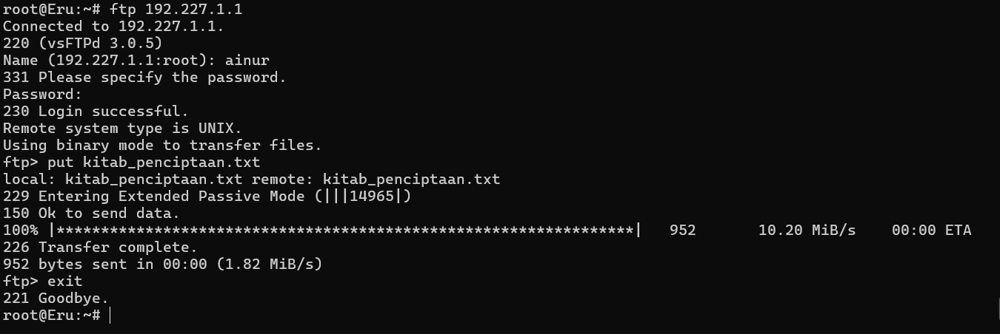
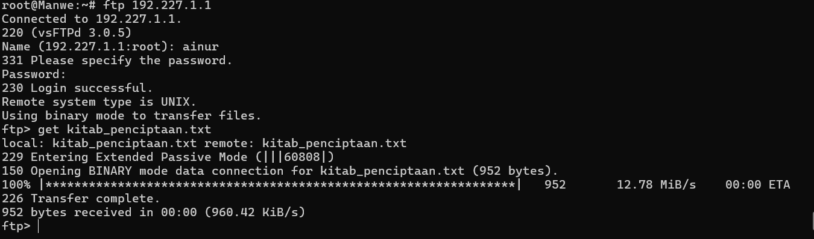
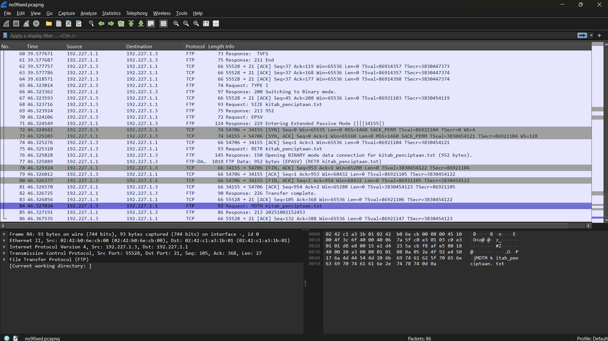
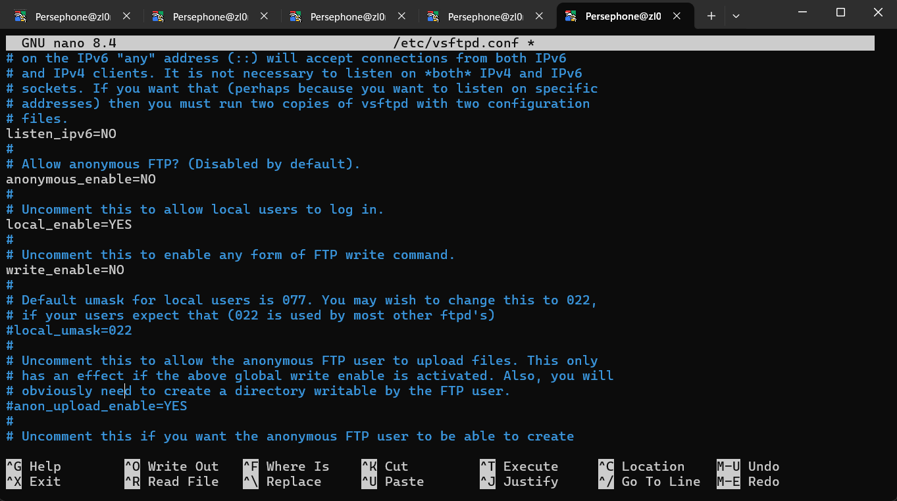
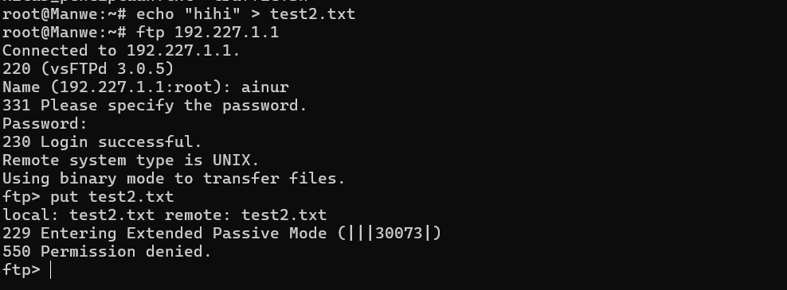
```
> in eru
wget --no-check-certificate "https://drive.google.com/uc?export=download&id=11ua2KgBu3MnHEIjhBnzqqv2RMEiJsILY" -O kitab_penciptaan.zip
unzip kitab_penciptaan.zip

service vsftpd start (klo mati/blm nyala)

login ftp > ftp 192.227.1.1 with ainur
put kitab_penciptaan.txt

>> on wireshark
start capture > manwe -> eru

> go to manwe
login ftp > ftp 192.227.1.1 with ainur
get kitab_penciptaan.txt

> go back to eru 
chown root:root /srv/ftp/shared
chmod 555 /srv/ftp/shared

> config the vsftpd
nano /etc/vsftpd.conf

listen=YES
listen_ipv6=NO
anonymous_enable=NO
local_enable=YES
write_enable=NO   <--- this one
chroot_local_user=YES
allow_writeable_chroot=YES
userlist_enable=YES
userlist_file=/etc/vsftpd.user_list
userlist_deny=YES

pkill vsftpd
/usr/sbin/vsftpd /etc/vsftpd.conf &
netstat -tulnp | grep :21

> go back to manwe (e.g)
echo "hiii" > test2.txt
login ftp > ftp 192.227.1.1 with ainur (it should be -xr)
put test2.txt -> should be 500 permission denied
```

> **Step-by-Step Walkthrough**

**1. Download and Upload the File on Eru**

On Eru, download the “Kitab Penciptaan” file:
```
wget --no-check-certificate "https://drive.google.com/uc?export=download&id=11ua2KgBu3MnHEIjhBnzqqv2RMEiJsILY" -O kitab_penciptaan.zip
unzip kitab_penciptaan.zip
```

Upload the file to the FTP server using ainur:
```
ftp 192.227.1.1 → login as ainur
put kitab_penciptaan.txt
```

If `vsftpd` isn’t running, start it first: `service vsftpd start`

**2. Start Wireshark Capture (Manwe ↔ Eru)**

On the Eru–Manwe interface, start a Wireshark capture. This will allow analysis of the download session from Manwe’s side.

**3. Download the File from Manwe**

On Manwe, connect to the FTP server using ainur: `ftp 192.227.1.1` → login as `ainur`. 
Then download the file using: `get kitab_penciptaan.txt`

**4. Analyze FTP Commands (Download)**

In Wireshark, apply the following filter: `ftp`

The key FTP command we will search that used to download is: `RETR kitab_penciptaan.txt`

**5. Change Directory Permission to Read-Only**

After the file is shared, Eru changes the shared directory permissions to read-only:
```
chown root:root /srv/ftp/shared
chmod 555 /srv/ftp/shared
```

Update the vsftpd configuration to disable write operations: `nano /etc/vsftpd.conf` and make sure: `write_enable=NO`


Restart vsftpd:
```
pkill vsftpd
/usr/sbin/vsftpd /etc/vsftpd.conf &
netstat -tulnp | grep :21
```
**6. Test Read-Only Access**

On Manwe, try uploading a file to test write permissions:
```
echo "hiii" > test2.txt
ftp 192.227.1.1 → login as ainur
put test2.txt
```

With expected result: `550 Permission denied`

Which confirms that the user `ainur` **can download (read) but no longer upload (write) files** `{xr-}`.

## Soal 10
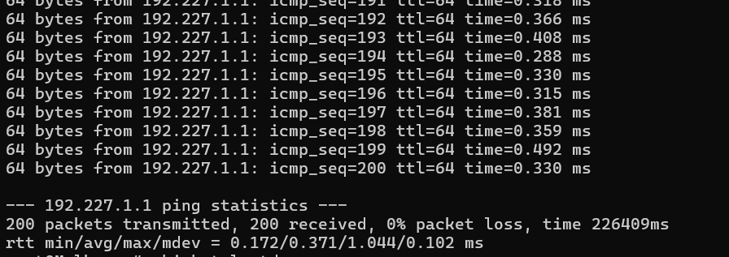
```
>> go to wireshark / GNS Client
start capture > melkor -> eru

> go to melkor
ping 192.227.1.1 -c 200

Analyze if theres a packet loss (it can be from capture result or the ping result)
```

> **Step-by-Step Walkthrough**

**1. Start Wireshark Capture**

Start capturing on the Melkor → Eru interface before launching the ping flood.
This records all ICMP packets exchanged between the two nodes.

**2. Run Ping Flood from Melkor**

On Melkor, execute:

`ping 192.227.1.1 -c 200`

 This volume of 200 ICMP pings is unusual for normal traffic and can be used to observe how the server responds under load.

**3. Analyze Ping Results (Melkor Terminal)**

The ping output will display something like:
```
--- 192.227.1.1 ping statistics ---
200 packets transmitted, 200 received, 0% packet loss, time xxxxms
rtt min/avg/max/mdev = x.xxx/x.xxx/x.xxx/x.xxx ms
```

Packet loss indicates dropped packets due to overload while Average RTT shows how the round-trip latency is affected by the flood.

If Eru remains stable, packet loss should be 0%.
If Eru is overwhelmed, we may see Increased RTT (avg and max significantly higher) and some packet loss percentage.

As the result in the image above, we can analyze that there's **no packet loss happened** while the `ping` is happpening.

## Soal 11
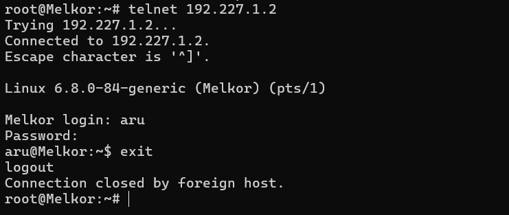
```
> on melkor
apt update
apt install openbsd-inetd telnetd -y || which telnetd <-- IT HAS TO BE `openbsd- `

> config inet.conf
nano /etc/inetd.conf
telnet  stream  tcp     nowait  root    /usr/sbin/tcpd  /usr/sbin/telnetd

pkill inetd 2>/dev/null 
/usr/sbin/inetd /etc/inetd.conf &  || service openbsd-inetd start
netstat -tulnp | grep :23

adduser <tester>
passwd <tester>

>> on wireshark
start capture : eru -> melkor
with filter : telnet

> go back to eru
sudo apt install -y telnet || which telnet 

telnet 192.227.1.2
login telnet -> new user

Analyze the capture of telnet
```

> **Step-by-Step Walkthrough**

**1. Install and Configure Telnet Server on Melkor**

On Melkor, install the Telnet server:
```
apt update
apt install openbsd-inetd telnetd -y
```

then edit `/etc/inetd.conf`:
```
nano /etc/inetd.conf

telnet  stream  tcp     nowait  root    /usr/sbin/tcpd  /usr/sbin/telnetd
```

Restart the service and verify that Telnet is listening on port 23:
```
pkill inetd 2>/dev/null
/usr/sbin/inetd /etc/inetd.conf & || service openbsd-inetd start
netstat -tulnp | grep :23
```

**2. Create a New User on Melkor**

Add a new user to be used for the Telnet login test:
```
adduser <tester>
passwd <tester>
```
**3. Start Wireshark Capture**

On the interface between Eru → Melkor, start Wireshark and apply: `telnet` which will only filters Telnet traffic.

**4. Login from Eru to Melkor via Telnet**

On Eru, connect to Melkor:

`telnet 192.227.1.2`

Then enter the username and password for the newly created user when prompted.

We should see a successful login session like in the screenshot (where user aru logs in, runs exit, and closes the session).

**5. Analyze the Wireshark Capture**

Look at the capture in Wireshark and use the display filter: `telnet`
and then look at the packet details during the login phase (with following the TCP stream or else).

The username and password appear as plain ASCII text in the Telnet data payload, and the credentials will appear clearly, for example:
```
login: tteesstteerr
Password: tteesstteerr
```
This is exactly how a malicious network sniffing in a `telnet` protocol and could monitor the traffic between both connection.

> **THEOREM**
> 
> Telnet (Telecommunication Network) is a protocol used to provide command-line based remote access to another computer over a network.
>
>The **core idea of Telnet** is:
>
>“Allow users to remotely log in to another machine and execute commands as if they were physically present — using **plaintext** communication.”
>
>**Key Concept**:
>Telnet **does not encrypt the communication** between **client and server**. All usernames, passwords, and commands are transmitted in plain text, making it highly vulnerable to eavesdropping and packet sniffing.

## Soal 12
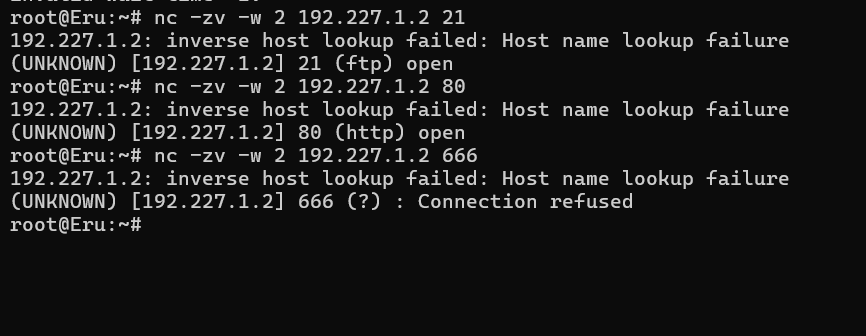
```
> in eru
apt-get install netcat-traditional

> go to melkor
apt update && apt install vsftpd
apt update && apt install apache2 -y

service vsftpd start
service apache2 start

> go back to eru
nc -zv 192.227.1.2 21 || 80 || 666

or

nc -zv 192.227.1.2 21
nc -zv 192.227.1.2 80
nc -zv 192.227.1.2 666
```

> **Step-by-Step Walkthrough**

**1. Install and Start Services on Melkor (IF HAVEN'T)**

On Melkor, install FTP and HTTP servers:
```
apt update && apt install vsftpd -y
apt update && apt install apache2 -y
```

and then start the services:
```
service vsftpd start
service apache2 start
```

This ensures:
- Port 21 (FTP) is open and listening
- Port 80 (HTTP) is open and serving web content
- Port 666 is not configured, so it should be closed.

**2. Install Netcat on Eru (IF HAVEN'T)**

On Eru, install the traditional version of netcat (for easier syntax):

`apt-get install netcat-traditional`

**3. Scan Ports from Eru to Melkor with netcat**

From Eru, run netcat with verbose mode (-v) and zero-I/O mode (-z) to test connection status without sending data.
```
nc -zv 192.227.1.2 21
nc -zv 192.227.1.2 80
nc -zv 192.227.1.2 666
```
and the results should be as the image above.
## Soal 13
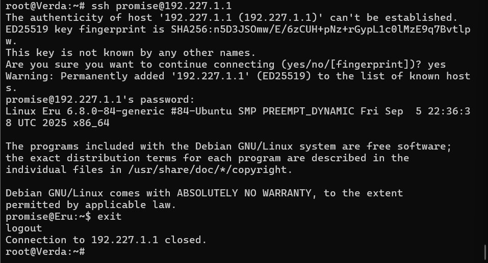
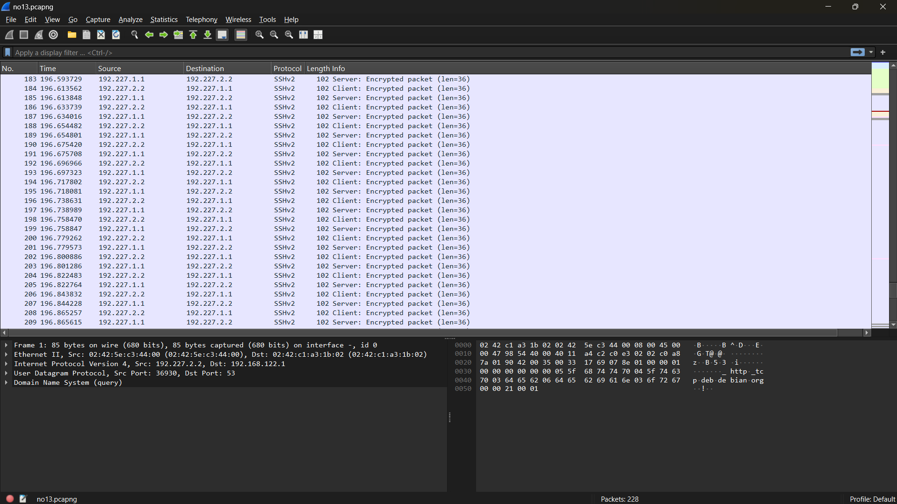
```
> in eru
apt update && apt install -y openssh-server (if haven't installed)

service ssh start || /etc/init.d/ssh start
service ssh status || netstat -tulnp | grep :22

adduser <tester>
passwd <tester>

>> on wireshark
start capture : eru -> verda

> go back to verda
apt install -y openssh-client (if haven't installed)
ssh <tester>@192.227.1/2.1
```

> **Step-by-Step Walkthrough**

**1. Set Up SSH Server on Eru**

On Eru, install (IF HAVEN'T), start the SSH server, and check if it's running:
```
apt update && apt install -y openssh-server
service ssh start
service ssh status || netstat -tulnp | grep :22
```
Then create a user for the SSH connection:
```
adduser <tester>
passwd <tester>
```
**2. Start Wireshark Capture**

Start capturing traffic on the Verda ↔ Eru interface before initiating the SSH connection with the Wireshark filter: `ssh`

**3. Connect via SSH from Verda to Eru**

On Verda, install the SSH client if needed (IF HAVEN'T) and then connect to it:
```
apt install -y openssh-client

ssh <tester>@192.227.1/2.1
```

we will see:
- A fingerprint verification prompt on first connection
- Username + password login
- A secure shell session after authentication

(As shown in the screenshot.)

Once logged in, run a simple command (e.g., exit) and close the session.

**4. Analyze the Capture with Wireshark**

See the traffic capture in Wireshark and apply: `ssh`

we will see:
- Initial SSH handshake packets (key exchange, algorithm negotiation)
- After handshake, encrypted packets only — no plaintext credentials or commands

and The “Info” column in Wireshark will show messages like:
```
Client Protocol: SSH-2.0-OpenSSH_9.x
Server Protocol: SSH-2.0-OpenSSH_9.x
Key Exchange Init
New Keys
Encrypted packet (len=xxx)
```
There is no field showing the username or password as plain-text, unlike the Telnet capture.

> **THEOREM**
> 
> SSH (Secure Shell) is a cryptographic network protocol for secure remote login and other network services.
>
>The **principle of SSH** is:
>“Provide a secure, **encrypted channel** for remote login and command execution over an insecure network.”
>
>Key Concept:
>**SSH uses encryption, authentication, and integrity** checks to prevent eavesdropping, man-in-the-middle attacks, and connection hijacking. It typically uses asymmetric cryptography (public/private key pairs) to authenticate servers and optionally clients.
>
>Example use case:
>Today, SSH is the standard tool for system administrators and developers to securely manage servers, transfer files (via SFTP/SCP), or establish secure tunnels.

---

## Soal 14
```c
nc 10.15.43.32 3401
```
### Question 1
How many packets are recorded in the pcapng file?
Format: int
#### Step 1
Directly look at the bottom of the Wireshark. It shows how many packets in the PCAP file.
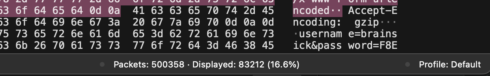
#### Answer
```c
500358
```
### Question 2
What are the user that successfully logged in?
Format: user:pass
#### Step 1
Use display filter.
```c
frame contains "success"
```

#### Step 2
Open the packet using Follow > TCP Stream.
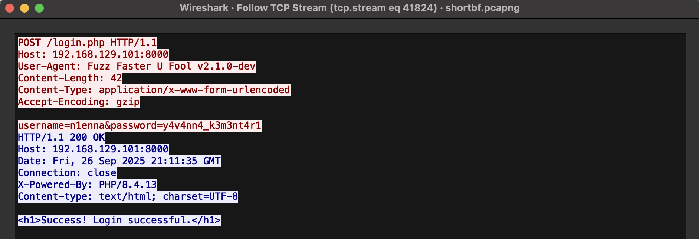
#### Answer
```c
n1enna:y4v4nn4_k3m3nt4r1
```
### Question 3
In which stream were the credentials found?
Format: int
#### Step 1
Look at the "Filter". It shows tcp.stream eq [stream]
#### Answer
```c
41824
```

### Question 4
What tools are used for brute force?
Format: Hydra v1.8.0-dev
#### Step 1
From the same 'Follow TCP Stream', we can also notice that the tools used for brute force is
#### Answer
```c
Fuzz Faster U Fool v2.1.0-dev
```

### Flag
```c
Congratulations! Here is your flag: KOMJAR25{Brut3_F0rc3_N7f6C7vdFVA5f8Rn7I7O7g7nS}
```
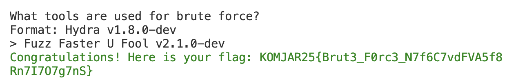

## Soal 15
```c
nc 10.15.43.32 3402
```
### Question 1
What device does Melkor use?
Format: string
#### Step 1
Look for GET DESCRIPTOR Response DEVICE packet. Look for fields named iManufacturer, iProduct, or iSerialNumber, then I found iProduct: 2 which means it’s in the index 2 of GET DESCRIPTOR Response STRING.
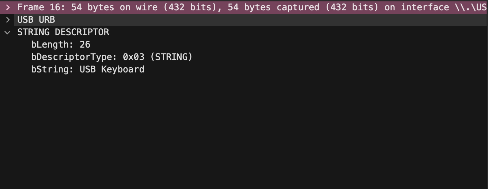
#### Answer
```c
Keyboard
```
### Question 2
What did Melkor write?
Format: string
#### Step 1
Use filter 
```c
usb.transfer_type == 0x01
```
0x01 is from the device decription.
#### Step 2
Save, File > Export Packet Dissections as Plain Text.
#### Step 3
Run the decode_hid.py, then decode the hex.
```c
python3 decode_hid.py hid_packets.txt > decoded.txt
```

#### Answer
```c
UGx6X3ByMHYxZGVfeTB1cl91czNybjRtZV80bmRfcDRzc3cwcmQ=
```
### Question 3
What is Melkor's secret message?
Format: string
#### Step 1
Just decode the encoded message from question 2 above.
```c
echo "UGx6X3ByMHYxZGVfeTB1cl91czNybjRtZV80bmRfcDRzc3cwcmQ=" | base64 --decode
```
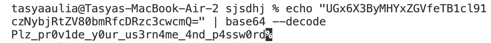
#### Answer
```c
Plz_pr0v1de_y0ur_us3rn4me_4nd_p4ssw0rd
```
### Flag
```c
Congratulations! Here is your flag: KOMJAR25{K3yb0ard_W4rr10r_BRxsRQ8etjElDYMOJBbksIR0d}
```
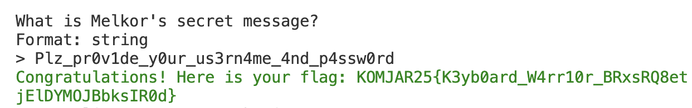
## Soal 16
```c
nc 10.15.43.32 3403
```
### Question 1
What credential did the attacker use to log in?
Format: user:pass
#### Step 1
Use display filter.
```c
ftp.request.command== "USER" || ftp.request.command == "PASS"
```
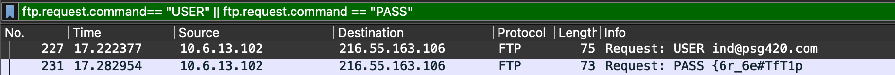
#### Answer
```c
ind@psg420.com:{6r_6e#TfT1p
```
### Question 2
How many files are suspected of containing malware?
Format: int
#### Step 1
Click Follow > TCP Stream from the previous way. There are q.exe, w.exe, e.exe, r.exe, t.exe. 
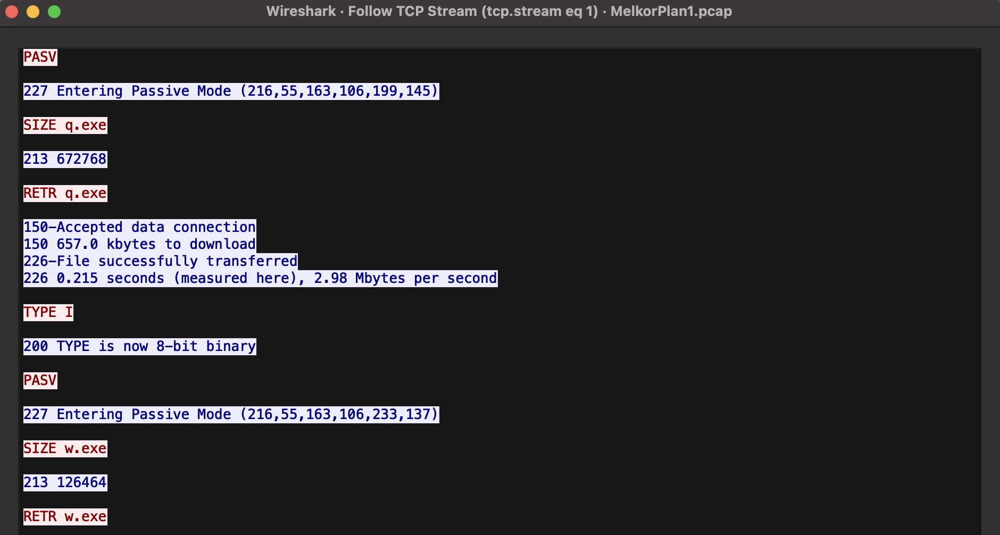
#### Answer
```c
5
```
### Question 3
What is the hash of the first file (q.exe)?
Format: sha256
#### Step 1

If we look at the "Follow TCP Stream", it shows like this

PASV

227 Entering Passive Mode (216,55,163,106,199,145)
227 Entering Passive Mode (h1,h2,h3,h4,p1,p2)
h1,h2,h3,h4 = IP address of the server
p1,p2 = two bytes that form the TCP port
#### Step 2
Calculate the port for filtering, by the formula
```
port = (p1*256) + p2
```
which means (for q3)
port = (199*256)+145 = 51089
#### Step 3
Do filtering with:
```c
ip.addr == 216.55.163.106 && tcp.port == 51089
```
#### Step 4
Follow > TCP Stream > Save as raw, name it q.exe
#### Step 5
Do hash sha256, with the command:
```c
sha256 q.exe
```
#### Answer
```c
ca34b0926cdc3242bbfad1c4a0b42cc2750d90db9a272d92cfb6cb7034d2a3bd
```
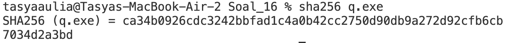
### Question 4
What is the hash of the second file (w.exe)?
Format: sha256
#### Step 1
Doing the same way as before. Do filtering with:
```c
ip.addr == 216.55.163.106 && tcp.port == 59785
```
#### Step 2
Do hash sha256, with the command:
```c
sha256 w.exe
```
#### Answer
```c
08eb941447078ef2c6ad8d91bb2f52256c09657ecd3d5344023edccf7291e9fc
```
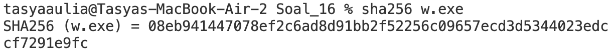
### Question 5
What is the hash of the third file (e.exe)?
Format: sha256
#### Step 1
Doing the same way as before. Do filtering with:
```c
ip.addr == 216.55.163.106 && tcp.port == 49506
```
#### Step 2
Do hash sha256, with the command:
```c
sha256 e.exe
```
#### Answer
```c
32e1b3732cd779af1bf7730d0ec8a7a87a084319f6a0870dc7362a15ddbd3199
```
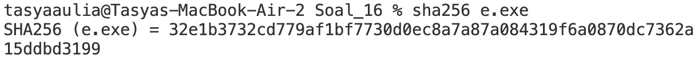
### Question 6
What is the hash of the third file (r.exe)?
Format: sha256
#### Step 1
Doing the same way as before. Do filtering with:
```c
ip.addr == 216.55.163.106 && tcp.port == 60899
```
Do hash sha256, with the command:
```c
sha256 r.exe
```
#### Answer
```c
4ebd58007ee933a0a8348aee2922904a7110b7fb6a316b1c7fb2c6677e613884
```
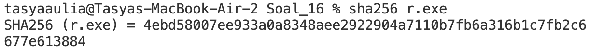
### Question 7
What is the hash of the third file (t.exe)?
Format: sha256
#### Step 1
Doing the same way as before. Do filtering with:
```c
ip.addr == 216.55.163.106 && tcp.port == 50157
```
Do hash sha256, with the command:
```c
sha256 t.exe
```
#### Answer
```c
10ce4b79180a2ddd924fdc95951d968191af2ee3b7dfc96dd6a5714dbeae613a
```
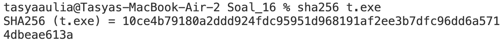
### Flag
```c
Congratulations! Here is your flag: KOMJAR25{Y0u_4r3_4_g00d_4nalyz3r_iDYON1mAHIfDzG2S49awKOBRm}
```
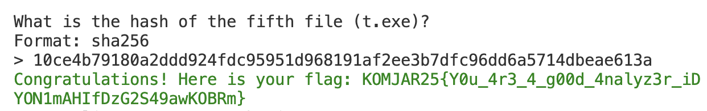
## Soal 17
```c
nc 10.15.43.32 3404
```
### Question 1
What is the name of the first suspicious file?
Format: file.exe
#### Step 1
File > Export Objects > HTTP
#### Step 2
There will be 3 files. Including the Invoice&MSO-Request.doc
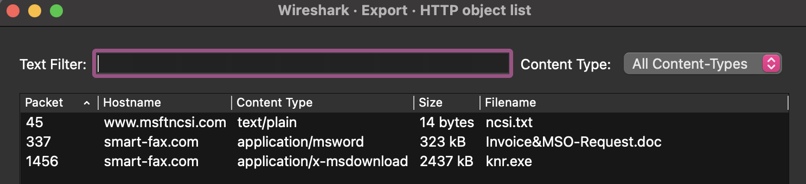
#### Answer
```c
Invoice&MSO-Request.doc
```
### Question 2
What is the name of the second suspicious file?
Format: file.exe
#### Step 1
Use the same way as the previous question, there will be 3 files. Including the knr.exe

#### Answer
```c
knr.exe
```
### Question 3
What is the hash of the second suspicious file (knr.exe)?
Format: sha256
#### Step 1
File > Export Objects > HTTP > Save
#### Step 2
Do hash 256, with the command:
```c
sha256 knr.exe
```
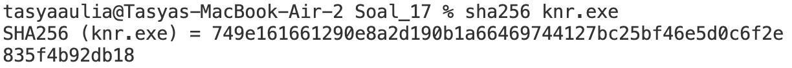
#### Answer
```c
749e161661290e8a2d190b1a66469744127bc25bf46e5d0c6f2e835f4b92db18
```
### Flag
```c
Congratulations! Here is your flag: KOMJAR25{M4ster_4n4lyzer_1xcg3WUUjKpux80gm8tEdFgL0}
```
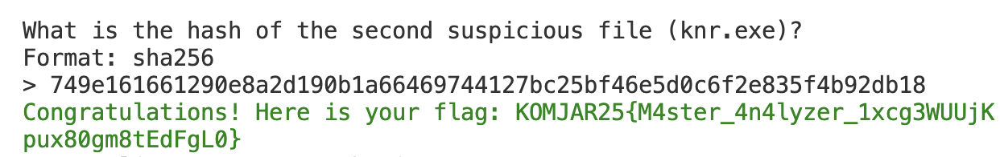
## Soal 18
```c
nc 10.15.43.32 3405
```
### Question 1
How many files are suspected of containing malware?
Format: int
#### Step 1
File > Export Objects > SMB
#### Step 2
If we look at the files, there are 2 files with the name of %5cWINDOWS%5c...
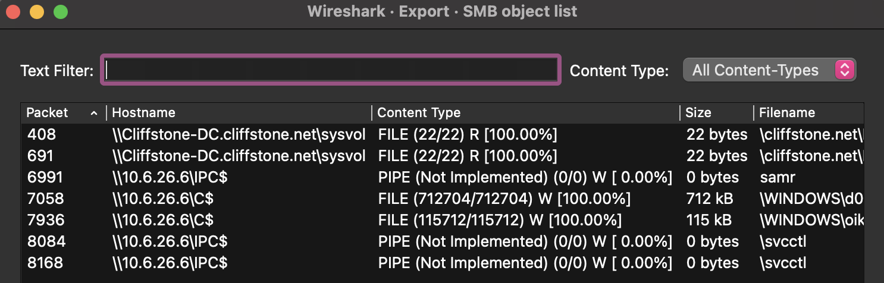
Some malware uses URL encoding (%5c) to obfuscate or trick antivirus, firewalls, or web filters and normal files or applications don’t use URL-encoded paths in names. So, their presence almost always suggests something crafted for exploit or stealth purposes.
#### Answer
```c
2
```
### Question 2
What is the name of the first malicious file?
Format: file.exe
#### Step 1
Look at those 2 files and the answer is:
#### Answer
```c
d0p2nc6ka3f_fixhohlycj4ovqfcy_smchzo_ub83urjpphrwahjwhv_o5c0fvf6.exe
```
### Question 3
Apa nama file berbahaya yang kedua?
Format: file.exe
#### Step 1
Look at those 2 files and the answer is:
#### Answer
```c
oiku9bu68cxqenfmcsos2aek6t07_guuisgxhllixv8dx2eemqddnhyh46l8n_di.exe
```
### Question 4
What is the hash of the first malicious file?
Format: sha256
#### Step 1
Do hash 256, with the command:
```c
sha256 %5cWINDOWS%5cd0p2nc6ka3f_fixhohlycj4ovqfcy_smchzo_ub83urjpphrwahjwhv_o5c0fvf6.exe
```
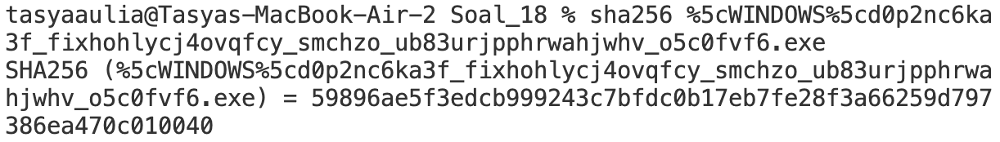
#### Answer
```c
59896ae5f3edcb999243c7bfdc0b17eb7fe28f3a66259d797386ea470c010040
```
### Question 5
What is the hash of the second malicious file?
Format: sha256
#### Step 1
Do hash 256, with the command:
```c
sha256 %5cWINDOWS%5coiku9bu68cxqenfmcsos2aek6t07_guuisgxhllixv8dx2eemqddnhyh46l8n_di.exe
```
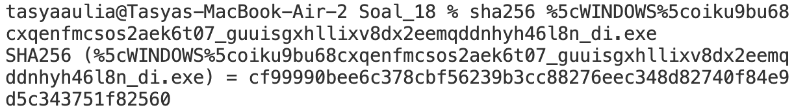
#### Answer
```c
cf99990bee6c378cbf56239b3cc88276eec348d82740f84e9d5c343751f82560
```
### Flag
```c
Congratulations! Here is your flag: KOMJAR25{Y0u_4re_g0dl1ke_e8XQLgCWiRzzsqZm9XqENF6bY}
```
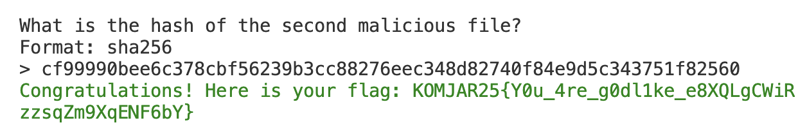
## Soal 19
```c
nc 10.15.43.32 3406
```
### Question 1
Who sent the threatening message?
Format: string (name)
#### Step 1
Look at the SMTP (Simple Mail Transfer Protocol) because it's the technique to send and receive email, by clicking the "Protocol".
#### Step 2
Do Follow > TCP Stream.
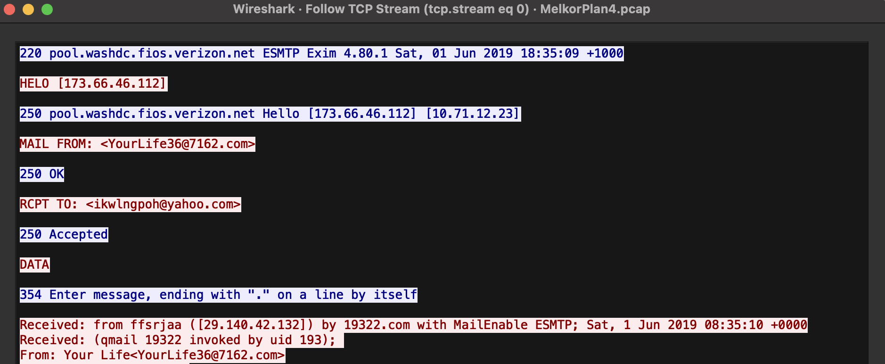
#### Answer
```c
Your Life
```
### Question 2
How much ransom did the attacker demand ($)?
Format: int
#### Step 1
By the same way as the previous question, the question could be easily answered by reading the content of the email.
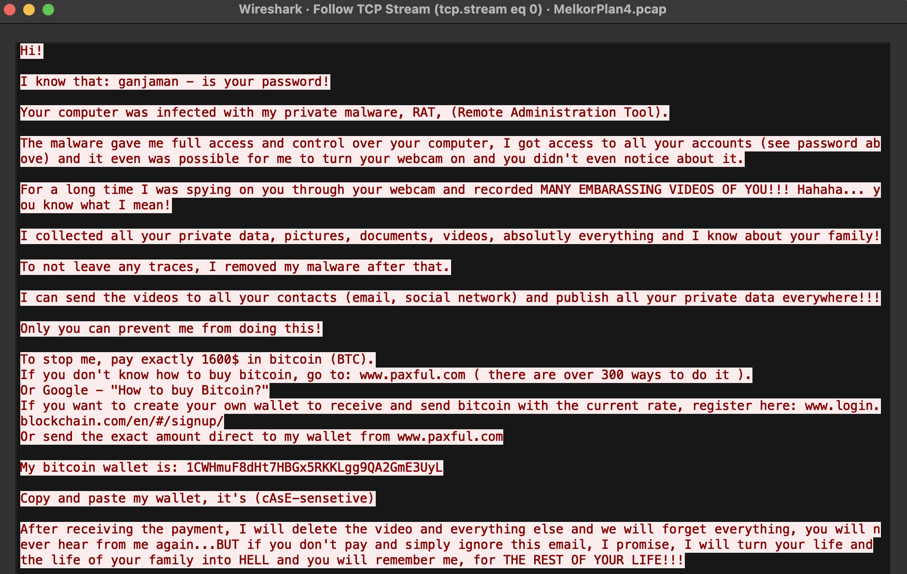
#### Answer
```c
1600
```
### Question 3
What is the attacker's bitcoin wallet?
Format: string
#### Step 1
By the same way as the previous question, the question could be easily answered by reading the content of the email.

#### Answer
```c
1CWHmuF8dHt7HBGx5RKKLgg9QA2GmE3UyL
```
### Flag
```c
Congratulations! Here is your flag: KOMJAR25{Y0u_4re_J4rk0m_G0d_uYgq9qyc7cdrJ2F5gyBt0otqK}
```
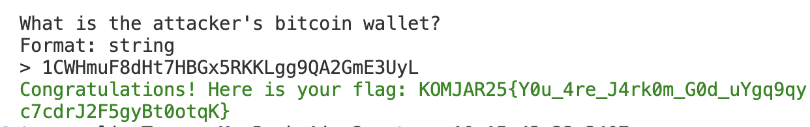
## Soal 20
```c
nc 10.15.43.32 3407
```
### Question 1
What encryption method is used?
Format: string
#### Step 1
Identify the protocol first, it seems like it's using TLS.
#### Step 2
Use display filter.
```c
tls.handshake.type == 2
```
becuase it is when server picks the TLS version and the single cipher suite used for the session, and returns selected key_share info.
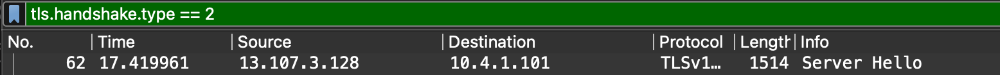
#### Answer
```c
TLS
```
### Question 2
What is the name of the malicious file placed by the attacker?
Format: file.exe
#### Step 1
From the folders given by the assistant, we also got keylogs.txt. Then click Wireshark > Preferences > Protocol (look for TLS) > Browse (insert the keylogs.txt). keylogs.txt is a pre-master secret log file that contains session keys generated by the browser (or attacker’s machine) during TLS handshakes. In other words:
It holds the “passwords” Wireshark needs to decrypt HTTPS traffic.
#### Step 2
Use display filter
```c
http.response.code == 200
```
Looking for 200/ success. Follow > TCP Stream, scroll up, then we can see that from the HTTP GET, there's a file named invest_20.dll
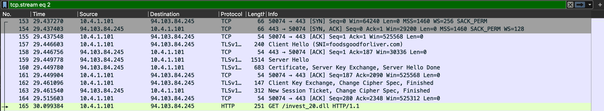
#### Answer
```c
invest_20.dll
```
### Question 3
What is the hash of the file containing the malware?
Format: sha256
#### Step 1
After the file has been saved (from the previous question), do hash sha256 with the command:
```c
sha256 invest_20.dll
```
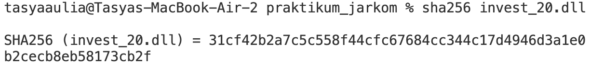
#### Answer
```c
31cf42b2a7c5c558f44cfc67684cc344c17d4946d3a1e0b2cecb8eb58173cb2f
```
### Flag
```c
Congratulations! Here is your flag: KOMJAR25{B3ware_0f_M4lw4re_Q1lBjLY0oJ3rCllqfcUS8GO4a}
```
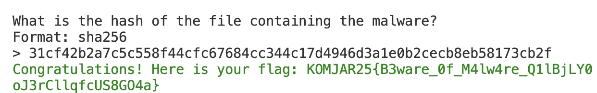


---
```
"sanctuary of the century."
- persephone, see u soon.
and (with)
- baksoogoreng.
```