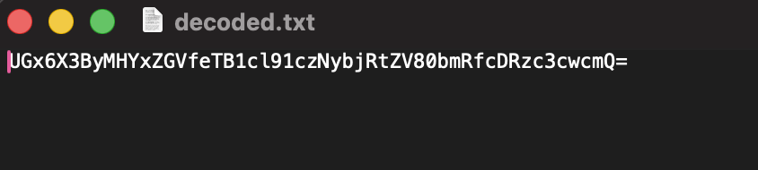

# Praktikum Modul 1 Jarkom

|No|Nama anggota|NRP|
|---|---|---|
|1. | Tasya Aulia Darmawan | 5027241009|
|2. | Ahmad Rafi Rafi F D | 5027241068|

## Soal 14
```c
nc 10.15.43.32 3401
```
### Question 1
How many packets are recorded in the pcapng file?
Format: int
#### Step 1
Directly look at the bottom of the Wireshark. It shows how many packets in the PCAP file.

#### Answer
```c
500358
```
### Question 2
What are the user that successfully logged in?
Format: user:pass
#### Step 1
Use display filter.
```c
frame contains "success"
```

#### Step 2
Open the packet using Follow > TCP Stream.

#### Answer
```c
n1enna:y4v4nn4_k3m3nt4r1
```
### Question 3
In which stream were the credentials found?
Format: int
#### Step 1
Look at the "Filter". It shows tcp.stream eq [stream]
#### Answer
```c
41824
```

### Question 4
What tools are used for brute force?
Format: Hydra v1.8.0-dev
#### Step 1
From the same 'Follow TCP Stream', we can also notice that the tools used for brute force is
#### Answer
```c
Fuzz Faster U Fool v2.1.0-dev
```

### Flag
```c
Congratulations! Here is your flag: KOMJAR25{Brut3_F0rc3_N7f6C7vdFVA5f8Rn7I7O7g7nS}
```


## Soal 15
```c
nc 10.15.43.32 3402
```
### Question 1
What device does Melkor use?
Format: string
#### Step 1
Look for GET DESCRIPTOR Response DEVICE packet. Look for fields named iManufacturer, iProduct, or iSerialNumber, then I found iProduct: 2 which means it’s in the index 2 of GET DESCRIPTOR Response STRING.

#### Answer
```c
Keyboard
```
### Question 2
What did Melkor write?
Format: string
#### Step 1
Use filter 
```c
usb.transfer_type == 0x01
```
0x01 is from the device decription.
#### Step 2
Save, File > Export Packet Dissections as Plain Text.
#### Step 3
Run the decode_hid.py, then decode the hex.
```c
python3 decode_hid.py hid_packets.txt > decoded.txt
```

#### Answer
```c
UGx6X3ByMHYxZGVfeTB1cl91czNybjRtZV80bmRfcDRzc3cwcmQ=
```
### Question 3
What is Melkor's secret message?
Format: string
#### Step 1
Just decode the encoded message from question 2 above.
```c
echo "UGx6X3ByMHYxZGVfeTB1cl91czNybjRtZV80bmRfcDRzc3cwcmQ=" | base64 --decode
```

#### Answer
```c
Plz_pr0v1de_y0ur_us3rn4me_4nd_p4ssw0rd
```
### Flag
```c
Congratulations! Here is your flag: KOMJAR25{K3yb0ard_W4rr10r_BRxsRQ8etjElDYMOJBbksIR0d}
```

## Soal 16
```c
nc 10.15.43.32 3403
```
### Question 1
What credential did the attacker use to log in?
Format: user:pass
#### Step 1
Use display filter.
```c
ftp.request.command== "USER" || ftp.request.command == "PASS"
```

#### Answer
```c
ind@psg420.com:{6r_6e#TfT1p
```
### Question 2
How many files are suspected of containing malware?
Format: int
#### Step 1
Click Follow > TCP Stream from the previous way. There are q.exe, w.exe, e.exe, r.exe, t.exe. 

#### Answer
```c
5
```
### Question 3
What is the hash of the first file (q.exe)?
Format: sha256
#### Step 1

If we look at the "Follow TCP Stream", it shows like this

PASV

227 Entering Passive Mode (216,55,163,106,199,145)
227 Entering Passive Mode (h1,h2,h3,h4,p1,p2)
h1,h2,h3,h4 = IP address of the server
p1,p2 = two bytes that form the TCP port
#### Step 2
Calculate the port for filtering, by the formula
```
port = (p1*256) + p2
```
which means (for q3)
port = (199*256)+145 = 51089
#### Step 3
Do filtering with:
```c
ip.addr == 216.55.163.106 && tcp.port == 51089
```
#### Step 4
Follow > TCP Stream > Save as raw, name it q.exe
#### Step 5
Do hash sha256, with the command:
```c
sha256 q.exe
```
#### Answer
```c
ca34b0926cdc3242bbfad1c4a0b42cc2750d90db9a272d92cfb6cb7034d2a3bd
```

### Question 4
What is the hash of the second file (w.exe)?
Format: sha256
#### Step 1
Doing the same way as before. Do filtering with:
```c
ip.addr == 216.55.163.106 && tcp.port == 59785
```
#### Step 2
Do hash sha256, with the command:
```c
sha256 w.exe
```
#### Answer
```c
08eb941447078ef2c6ad8d91bb2f52256c09657ecd3d5344023edccf7291e9fc
```

### Question 5
What is the hash of the third file (e.exe)?
Format: sha256
#### Step 1
Doing the same way as before. Do filtering with:
```c
ip.addr == 216.55.163.106 && tcp.port == 49506
```
#### Step 2
Do hash sha256, with the command:
```c
sha256 e.exe
```
#### Answer
```c
32e1b3732cd779af1bf7730d0ec8a7a87a084319f6a0870dc7362a15ddbd3199
```

### Question 6
What is the hash of the third file (r.exe)?
Format: sha256
#### Step 1
Doing the same way as before. Do filtering with:
```c
ip.addr == 216.55.163.106 && tcp.port == 60899
```
Do hash sha256, with the command:
```c
sha256 r.exe
```
#### Answer
```c
4ebd58007ee933a0a8348aee2922904a7110b7fb6a316b1c7fb2c6677e613884
```

### Question 7
What is the hash of the third file (t.exe)?
Format: sha256
#### Step 1
Doing the same way as before. Do filtering with:
```c
ip.addr == 216.55.163.106 && tcp.port == 50157
```
Do hash sha256, with the command:
```c
sha256 t.exe
```
#### Answer
```c
10ce4b79180a2ddd924fdc95951d968191af2ee3b7dfc96dd6a5714dbeae613a
```

### Flag
```c
Congratulations! Here is your flag: KOMJAR25{Y0u_4r3_4_g00d_4nalyz3r_iDYON1mAHIfDzG2S49awKOBRm}
```

## Soal 17
```c
nc 10.15.43.32 3404
```
### Question 1
What is the name of the first suspicious file?
Format: file.exe
#### Step 1
File > Export Objects > HTTP
#### Step 2
There will be 3 files. Including the Invoice&MSO-Request.doc

#### Answer
```c
Invoice&MSO-Request.doc
```
### Question 2
What is the name of the second suspicious file?
Format: file.exe
#### Step 1
Use the same way as the previous question, there will be 3 files. Including the knr.exe

#### Answer
```c
knr.exe
```
### Question 3
What is the hash of the second suspicious file (knr.exe)?
Format: sha256
#### Step 1
File > Export Objects > HTTP > Save
#### Step 2
Do hash 256, with the command:
```c
sha256 knr.exe
```

#### Answer
```c
749e161661290e8a2d190b1a66469744127bc25bf46e5d0c6f2e835f4b92db18
```
### Flag
```c
Congratulations! Here is your flag: KOMJAR25{M4ster_4n4lyzer_1xcg3WUUjKpux80gm8tEdFgL0}
```

## Soal 18
```c
nc 10.15.43.32 3405
```
### Question 1
How many files are suspected of containing malware?
Format: int
#### Step 1
File > Export Objects > SMB
#### Step 2
If we look at the files, there are 2 files with the name of %5cWINDOWS%5c...

#### Answer
```c
2
```
### Question 2
What is the name of the first malicious file?
Format: file.exe
#### Step 1
Look at those 2 files and the answer is:
#### Answer
```c
d0p2nc6ka3f_fixhohlycj4ovqfcy_smchzo_ub83urjpphrwahjwhv_o5c0fvf6.exe
```
### Question 3
Apa nama file berbahaya yang kedua?
Format: file.exe
#### Step 1
Look at those 2 files and the answer is:
#### Answer
```c
oiku9bu68cxqenfmcsos2aek6t07_guuisgxhllixv8dx2eemqddnhyh46l8n_di.exe
```
### Question 4
What is the hash of the first malicious file?
Format: sha256
#### Step 1
Do hash 256, with the command:
```c
sha256 %5cWINDOWS%5cd0p2nc6ka3f_fixhohlycj4ovqfcy_smchzo_ub83urjpphrwahjwhv_o5c0fvf6.exe
```

#### Answer
```c
59896ae5f3edcb999243c7bfdc0b17eb7fe28f3a66259d797386ea470c010040
```
### Question 5
What is the hash of the second malicious file?
Format: sha256
#### Step 1
Do hash 256, with the command:
```c
sha256 %5cWINDOWS%5coiku9bu68cxqenfmcsos2aek6t07_guuisgxhllixv8dx2eemqddnhyh46l8n_di.exe
```

#### Answer
```c
cf99990bee6c378cbf56239b3cc88276eec348d82740f84e9d5c343751f82560
```
### Flag
```c
Congratulations! Here is your flag: KOMJAR25{Y0u_4re_g0dl1ke_e8XQLgCWiRzzsqZm9XqENF6bY}
```

## Soal 19
```c
nc 10.15.43.32 3406
```
### Question 1
Who sent the threatening message?
Format: string (name)
#### Step 1
Look at the SMTP (Simple Mail Transfer Protocol) because it's the technique to send and receive email, by clicking the "Protocol".
#### Step 2
Do Follow > TCP Stream.

#### Answer
```c
Your Life
```
### Question 2
How much ransom did the attacker demand ($)?
Format: int
#### Step 1
By the same way as the previous question, the question could be easily answered by reading the content of the email.

#### Answer
```c
1600
```
### Question 3
What is the attacker's bitcoin wallet?
Format: string
#### Step 1
By the same way as the previous question, the question could be easily answered by reading the content of the email.

#### Answer
```c
1CWHmuF8dHt7HBGx5RKKLgg9QA2GmE3UyL
```
### Flag
```c
Congratulations! Here is your flag: KOMJAR25{Y0u_4re_J4rk0m_G0d_uYgq9qyc7cdrJ2F5gyBt0otqK}
```

## Soal 20
```c
nc 10.15.43.32 3407
```
### Question 1
What encryption method is used?
Format: string
#### Step 1
Identify the protocol first, it seems like it's using TLS.
#### Step 2
Use display filter.
```c
tls.handshake.type == 2
```
becuase it is when server picks the TLS version and the single cipher suite used for the session, and returns selected key_share info.

#### Answer
```c
TLS
```
### Question 2
What is the name of the malicious file placed by the attacker?
Format: file.exe
#### Step 1
From the folders given by the assistant, we also got keylogs.txt. Then click Wireshark > Preferences > Protocol (look for TLS) > Browse (insert the keylogs.txt).
#### Step 2
Use display filter
```c
http.response.code == 200
```
Looking for 200/ success. Follow > TCP Stream, scroll up, then we can see that from the HTTP GET, there's a file named invest_20.dll

#### Answer
```c
invest_20.dll
```
### Question 3
What is the hash of the file containing the malware?
Format: sha256
#### Step 1
After the file has been saved (from the previous question), do hash sha256 with the command:
```c
sha256 invest_20.dll
```

#### Answer
```c
31cf42b2a7c5c558f44cfc67684cc344c17d4946d3a1e0b2cecb8eb58173cb2f
```
### Flag
```c
Congratulations! Here is your flag: KOMJAR25{B3ware_0f_M4lw4re_Q1lBjLY0oJ3rCllqfcUS8GO4a}
```

